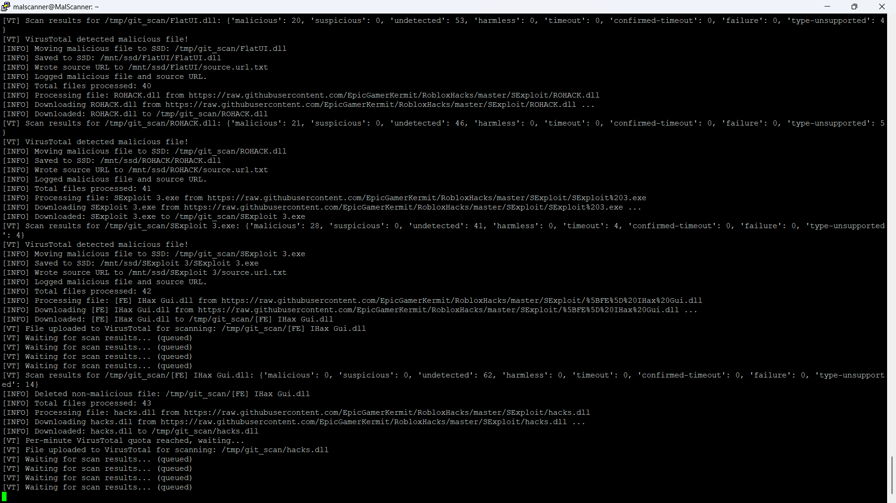
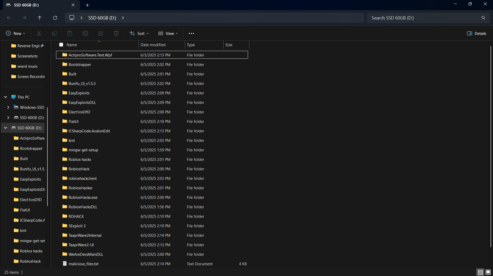
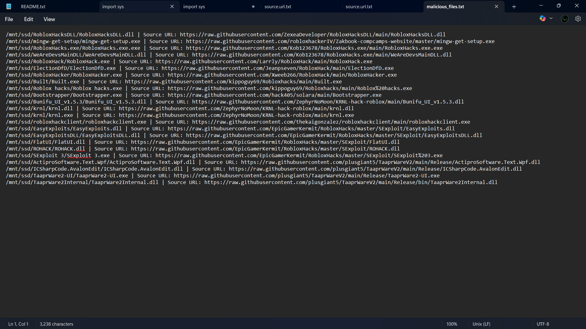

# Git-MalScan

---
A Python script to **automatically search GitHub for `.exe, .com, .pif, .msi, .scr, .bat, .cmd, .dll, .sys, .drv, .ocx, .vbs, .js, .ps1, .hta, .wsf, .lnk, .sh, .py, .zip, .rar, .7z, .tar, .gz, .iso, .docm, .xlsm, .pptm, .apk, .jar` files**, download them, and scan them for malware using [ClamAV](https://www.clamav.net/) and [VirusTotal](https://www.virustotal.com/). Results are logged and malicious files are saved for further analysis.
---
What malscan looks like while running with verbose:



What the folder output will look like:



What the Malware Log will look like:



---
# MalScanV4.py uses ClamAV and Virus Total for detection
# MalScanV4VT.py uses Virus Total Exclusively
---

## Features

- Searches GitHub repositories for `.exe, .com, .pif, .msi, .scr, .bat, .cmd, .dll, .sys, .drv, .ocx, .vbs, .js, .ps1, .hta, .wsf, .lnk, .sh, .py, .zip, .rar, .7z, .tar, .gz, .iso, .docm, .xlsm, .pptm, .apk, .jar` files using the GitHub API.
- Should Comply with API Limits for Virus Total.
- Downloads and scans each file with ClamAV.
- Then scans files with VirusTotal (API key required, respects rate limits).
- Maintains blocklists to avoid reprocessing the same files or repositories.
- Has extensive verbose mode, can choose wether you want to see the verbose when starting a scan.
- Allows for setting recursive search depth
- You can specify up to 30-100 for search query at the moment, however this searches three filters so you'll likely get around 300 repos to search
- Allows for setting a keyword to search for, IE: Roblox Hacks, and it will filter only from this topic
- Designed for use on a Raspberry Pi or Linux system with SSD storage.
- Automatically installs missing Python dependencies.
- Automatically logs the source address to a file inside a folder containing the binary, allows for easier reporting.
- Streams scan events into TimescaleDB when Postgres credentials are supplied via `.env`.
---

## Requirements

- Python 3.7+
- [ClamAV](https://www.clamav.net/) installed and available in your PATH
- A [GitHub Personal Access Token](https://github.com/settings/tokens) with `repo` access
- A [VirusTotal API key](https://www.virustotal.com/gui/join-us) (optional, but recommended)
- Linux system (uses `/mnt/ssd` and `nice` command; adjust for other OSes as needed)

---

## Setup

1. **Clone this repository or download the script:**

    ```sh
    git clone https://github.com/Net-Zer0/MalScan.git
    cd malscan.py
    ```

2. **Install ClamAV:** -If you are using V3.1VT, you may skip this step!

    ```sh
    sudo apt update
    sudo apt install clamav
    ```

3. **Edit the script:**

    - Replace the `GITHUB_TOKEN` and `VT_API_KEY` variables at the top of the script with your own keys.
    - You can create a token in the developer section of Githubs settings for your account, create a new personal one and copy that and use it in the script, However I must empathize you must never share this!!!

4. **(Optional) Adjust directories:**

    - By default, the script uses `/mnt/ssd` for storage and `/tmp/git_scan` for temporary files. Change these if needed.
5. **(Non Optional) Adjustment to directories:**
    - ALSO more importantly change the def mount portion `def mount_ssd():` where  `/dev/sda3` is defined, this needs to be set to your drive to work, IE: SSD or USB etc. using **lsblk** can find your mount point!
    - ***THIS STEP IS CRUCIAL TO THE SCRIPT WORKING AND REQUIRES SOME KNOWLEDGE OF PYTHON!!!***

6. **(Optional) Adjust the search query to include other file types**
   `SEARCH_QUERY = "extension:exe OR extension:dll OR extension:scr OR extension:bat OR extension:cmd OR extension:js OR extension:vbs OR extension:ps1 OR extension:msi OR extension:com OR extension:jar"
SEARCHES = [
    {"desc": "fewest stars", "sort": "stars", "order": "asc"},
    {"desc": "newly indexed", "sort": "indexed", "order": "desc"},
    {"desc": "recently updated", "sort": "updated", "order": "desc"},
]`
- you can pretty much change or add any scannable file type to `extensions:X OR extension:X` meaning you can easily add more to the scope by tweaking it until I add more to the base script!
---

## Usage

Run the script with Python 3:

```sh
sudo python3 MalScanV4.py or MalScan4VT.py
```
--- 
## TimescaleDB Ingestion
- Run the DDL in `schema.sql` against your TimescaleDB database so the required tables and hypertables exist.
- Provide `POSTGRES_USERNAME`, `POSTGRES_PASSWORD`, `POSTGRES_DATABASE`, `POSTGRES_HOSTNAME`, and `POSTGRES_PORT` (for example via `.env`). The script loads these on startup.
- When credentials are present the scanner streams repository checks and per-file scan results into TimescaleDB using the `MalScanV4` ingestion pipeline.
- If any credential is missing or the connection fails, ingestion is skipped and the scanner continues to operate locally.
---
## Recommendations - For Running On PI or Linux SBC
I would recommend if you are using Raspbian to use the 64bit version and run it in lite as we will be using the command line exclusively. I would also recommend if you want to run it for long periods of time to use `tmux new -s scan` or some other alternative like `screen` to keep the process running if you are using SSH, this will allow you to come back and reattach to the program when leaving it unattended if you do not have a monitor and keyboard to run it as it's own workstation. among other things I am investigating freezing issues with ClamAV on my 3B+, however I'm fairly certain this is due to undervoltage on my part. when I figure that out I may make ClamAV scan with more vigor, It will likely also work better on hardware that is not from 2018. At some point I will be upgrading to a RPI 5 to see if it runs better, If you are getting freezing issues I would recommend only running the VT only version for now.

---
## Future Updates!

- To Be Determined!!!
- Will add more features and functions to do with detection or extensions upon majority request!
---
## Version Changelog
- V1 - inital iteration of MalScan
- V2 & V2VT - added folders and sorting methods, new VT version for exclusively using virus totals API for slower hardware.
- V3 & V3VT - added other extension to the scope of the search, ones commonly associated with malware.
- V3.1 & V3.1VT - removed unused function for optimization and added more API error handling
- V4 & V4VT - `.pif, .drv, .ocx, .sys, .hta, .wsf, .lnk, .sh, .py, .zip, .rar, .7z, .tar, .gz, .iso, .docm, .xlsm, .pptm, .apk` added to scan list
---
## Disclaimer
Git-MalScan is provided for research and cybersecurity awareness purposes only. The authors and contributors are not responsible for any potential harm, system damage, data loss, or security breaches that may result from running this tool.
- Users must exercise caution when scanning and handling binaries, as malware can pose significant risks.
- Running Git-MalScan requires proper security measures, such as isolated environments, virtual machines, or dedicated analysis setups.
- This tool does not guarantee complete or perfect malware detection and should not replace professional cybersecurity solutions.
By using Git-MalScan, you acknowledge and accept these risks and take full responsibility for its usage.
---
